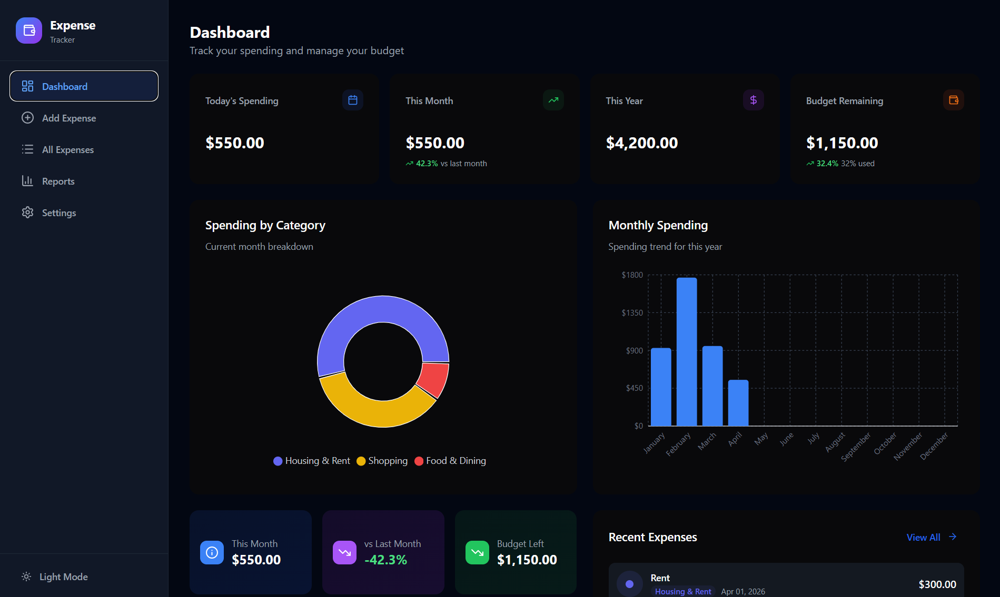
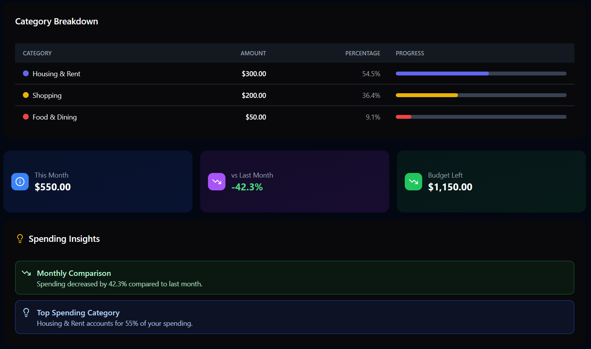
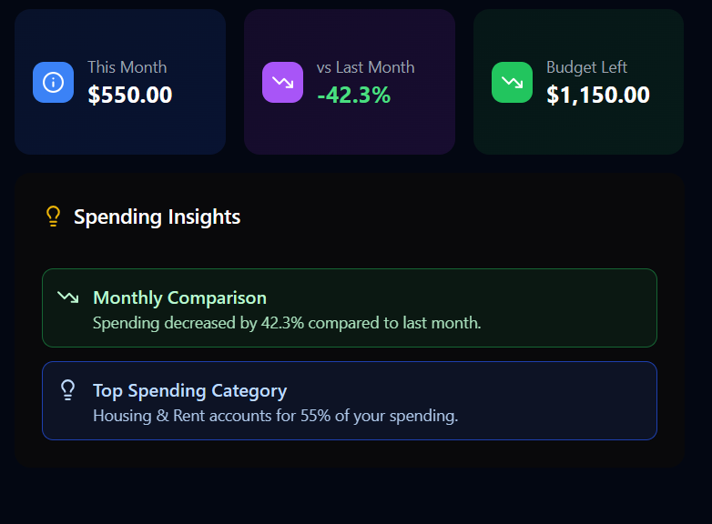
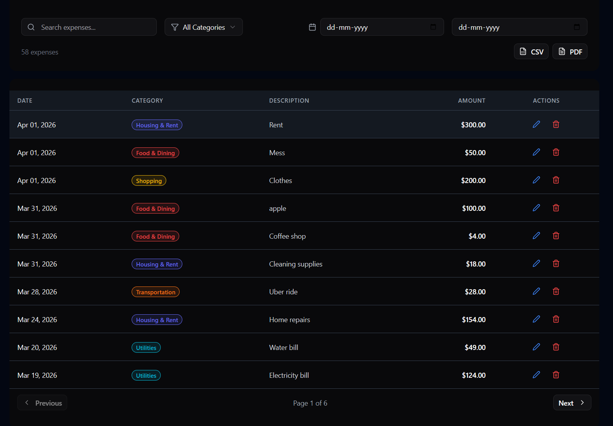
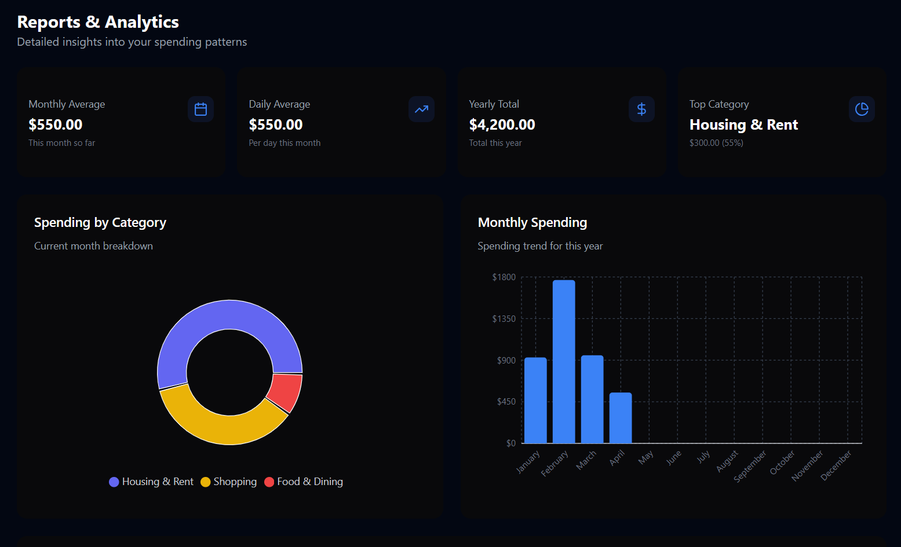
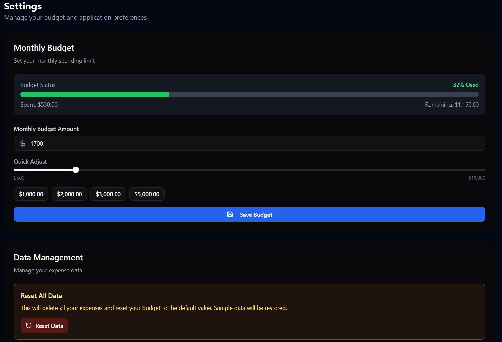

# Daily Expense Tracker

A full-featured expense management application built with React, TypeScript, and Tailwind CSS. Track your daily expenses, visualize spending patterns, set budgets, and gain insights into your financial habits.



## 🚀 Features

### Core Capabilities
- **Expense Management**: Add, edit, and delete expenses with ease.
- **Visual Analytics**: Interactive charts for category breakdown and monthly trends.
- **Budget Tracking**: Set monthly limits and receive usage alerts (80%, 100%).
- **Personalized Insights**: AI-driven analysis of your spending habits and weekend trends.
- **Data Export**: Save your financial records as CSV or professional PDF reports.
- **Search & Filters**: Quickly find transactions by category, date range, or description.

### UI/UX Highlights
- **Responsive Design**: Seamless experience across mobile, tablet, and desktop.
- **Dark Mode Support**: Elegant dark theme for comfortable nighttime tracking.
- **Interactive UI**: Micro-animations and smooth transitions for a premium feel.

---

## 📸 Screenshots

| Dashboard Overview | Category Analysis |
|:---:|:---:|
|  |  |

| Spending Insights | Expense History |
|:---:|:---:|
|  |  |

| Financial Reports | Application Settings |
|:---:|:---:|
|  |  |

---

## 🛠️ Tech Stack

- **React 18** - UI library with hooks
- **TypeScript** - Type-safe development
- **Tailwind CSS** - Utility-first styling
- **shadcn/ui** - Modern UI components
- **Recharts** - Data visualization
- **jsPDF** - PDF generation
- **Lucide React** - Icon library

---

## 📁 Project Structure

```bash
app/src/
├── components/
│   ├── custom/           # Custom application components
│   │   ├── CategoryChart.tsx
│   │   ├── MonthlyChart.tsx
│   │   ├── SpendingInsights.tsx
│   │   └── ... 
│   └── ui/               # shadcn/ui components
├── context/
│   └── ExpenseContext.tsx # Global state management
├── pages/                # Main application views
│   ├── Dashboard.tsx
│   ├── Expenses.tsx
│   ├── Reports.tsx
│   └── Settings.tsx
├── types/                # TypeScript definitions
├── utils/                # Helper functions & storage logic
└── ...
```

---

## 🚦 Getting Started

### Prerequisites
- Node.js 18+ 
- npm or yarn

### Installation

1. **Clone the repository**:
   ```bash
   git clone https://github.com/Adityahatake/Daily_Expense_Tracker.git
   ```

2. **Install dependencies**:
   ```bash
   cd app
   npm install
   ```

3. **Start development server**:
   ```bash
   npm run dev
   ```

---

## 📄 License

This project is licensed under the MIT License.

## 🤝 Support

For issues or feature requests, please open an issue in the repository.

---

**Developed with ❤️ by [Aditya Daksh](https://github.com/Adityahatake)**
